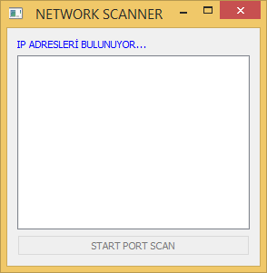

<h1 align="center">Python Net Scanner</h1>

<em><h5 align="center">College Homework</h5></em>

<p align="center"></img></p>

## About this project

    You can learn the active local IPs in the lan you are connected to and perform port scans on them.

## Features

- [QT](https://doc.qt.io/qtforpython/) for user interface
- [Nmap](https://pypi.org/project/python-nmap/) for network scan

## How can use ?

```shell script
git clone https://github.com/byRespect/net-scanner
cd net-scanner
pip install -r requirements.txt
python3 main.py
```
